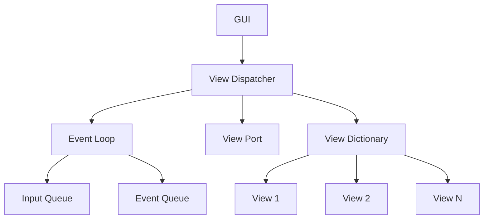
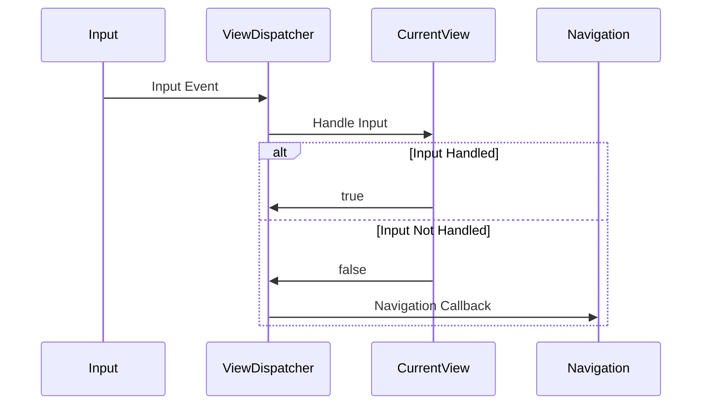
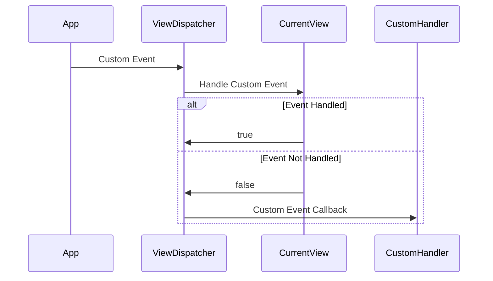

# Flipper Zero View Dispatcher Architecture

## Overview

The View Dispatcher is a core component of the Flipper Zero GUI framework that manages multiple views and handles user input and event routing. It acts as a mediator between the GUI system and individual views, providing a robust mechanism for view switching and event handling.

## Core Components

### 1. View Dispatcher

The View Dispatcher (`ViewDispatcher`) is the main orchestrator that:
- Manages multiple views
- Handles input events
- Routes custom events
- Controls view switching
- Manages the event loop

```c
typedef struct ViewDispatcher {
    ViewPort* view_port;
    Gui* gui;
    FuriEventLoop* event_loop;
    FuriMessageQueue* input_queue;
    FuriMessageQueue* event_queue;
    ViewDict_t views;
    View* current_view;
    // ... other fields
} ViewDispatcher;
```

### 2. View

A View (`View`) represents a single screen or UI component with:
- Drawing capabilities
- Input handling
- Event processing
- Model management

```c
typedef struct View {
    ViewDrawCallback draw_callback;
    ViewInputCallback input_callback;
    ViewCustomCallback custom_callback;
    ViewModelType model_type;
    void* model;
    ViewOrientation orientation;
    // ... other fields
} View;
```

## Architecture Diagram



## Key Concepts

### 1. Event Loop and Message Queues

The View Dispatcher uses two message queues:
1. `input_queue`: Handles input events (buttons, touches)
2. `event_queue`: Handles custom application events

```c
view_dispatcher->input_queue = furi_message_queue_alloc(VIEW_DISPATCHER_QUEUE_LEN, sizeof(InputEvent));
view_dispatcher->event_queue = furi_message_queue_alloc(VIEW_DISPATCHER_QUEUE_LEN, sizeof(uint32_t));
```

### 2. View Management

Views are stored in a dictionary with unique IDs:

```c
void view_dispatcher_add_view(ViewDispatcher* view_dispatcher, uint32_t view_id, View* view);
void view_dispatcher_remove_view(ViewDispatcher* view_dispatcher, uint32_t view_id);
void view_dispatcher_switch_to_view(ViewDispatcher* view_dispatcher, uint32_t view_id);
```

### 3. View Types

The View Dispatcher supports three types of views:
```c
typedef enum {
    ViewDispatcherTypeDesktop,    // Fullscreen with status bar
    ViewDispatcherTypeWindow,     // Window with status bar
    ViewDispatcherTypeFullscreen  // Full screen without status bar
} ViewDispatcherType;
```

### 4. Model Management

Views support two types of models:
1. `ViewModelTypeLockFree`: Simple data model without synchronization
2. `ViewModelTypeLocking`: Thread-safe model with mutex protection

```c
void view_allocate_model(View* view, ViewModelType type, size_t size);
void* view_get_model(View* view);
void view_commit_model(View* view, bool update);
```

## Event Queue Architecture

The View Dispatcher's event handling system is built on top of FuriOS's event loop mechanism, providing an efficient and non-blocking way to handle both input events and custom application events. Here's a detailed look at how it works:

### Queue Structure and Setup

The View Dispatcher maintains two separate message queues:

```c
// Queue for input events (buttons, touches)
FuriMessageQueue* input_queue;

// Queue for custom application events
FuriMessageQueue* event_queue;
```

Both queues are initialized during View Dispatcher creation with a fixed size:

```c
#define VIEW_DISPATCHER_QUEUE_LEN (16U)

input_queue = furi_message_queue_alloc(VIEW_DISPATCHER_QUEUE_LEN, sizeof(InputEvent));
event_queue = furi_message_queue_alloc(VIEW_DISPATCHER_QUEUE_LEN, sizeof(uint32_t));
```

### Event Loop Integration

The View Dispatcher subscribes these queues to the FuriEventLoop system using the `FuriEventLoopEventIn` flag:

```c
furi_event_loop_subscribe_message_queue(
    event_loop,
    input_queue,
    FuriEventLoopEventIn,
    view_dispatcher_run_input_callback,
    view_dispatcher);

furi_event_loop_subscribe_message_queue(
    event_loop,
    event_queue,
    FuriEventLoopEventIn,
    view_dispatcher_run_event_callback,
    view_dispatcher);
```

This setup enables:
- Asynchronous event processing
- Non-blocking operation
- Efficient event routing
- Priority-based handling

### Event Flow Sequence

1. **Input Events**:
   ```mermaid
   sequenceDiagram
       participant HW as Hardware Input
       participant IQ as Input Queue
       participant VD as View Dispatcher
       participant EL as Event Loop
       participant View as Current View
       
       HW->>IQ: Push Input Event
       EL->>VD: Notify Event Available
       VD->>IQ: Pull Event
       VD->>View: Process Input
       alt Event Handled
           View->>VD: Return true
       else Event Not Handled
           View->>VD: Return false
           VD->>VD: Handle Navigation
       end
   ```

2. **Custom Events**:
   ```mermaid
   sequenceDiagram
       participant App as Application
       participant EQ as Event Queue
       participant VD as View Dispatcher
       participant EL as Event Loop
       participant View as Current View
       
       App->>EQ: Push Custom Event
       EL->>VD: Notify Event Available
       VD->>EQ: Pull Event
       VD->>View: Process Custom Event
       alt Event Handled
           View->>VD: Return true
       else Event Not Handled
           View->>VD: Return false
           VD->>VD: Call Custom Handler
       end
   ```

### Queue Processing

The View Dispatcher processes events through dedicated callback functions:

1. **Input Processing**:
```c
void view_dispatcher_handle_input(ViewDispatcher* view_dispatcher, InputEvent* event) {
    if(view_dispatcher->current_view) {
        // Try handling in current view
        bool handled = view_input(view_dispatcher->current_view, event);
        if(!handled && event->type == InputTypeShort) {
            // If not handled and it's a short press, try navigation
            if(view_dispatcher->navigation_event_callback) {
                view_dispatcher->navigation_event_callback(view_dispatcher->event_context);
            }
        }
    }
}
```

2. **Custom Event Processing**:
```c
void view_dispatcher_handle_custom_event(ViewDispatcher* view_dispatcher, uint32_t event) {
    if(view_dispatcher->current_view) {
        // Try handling in current view
        bool handled = view_custom(view_dispatcher->current_view, event);
        if(!handled) {
            // If not handled, try global custom event handler
            if(view_dispatcher->custom_event_callback) {
                view_dispatcher->custom_event_callback(view_dispatcher->event_context, event);
            }
        }
    }
}
```

### Benefits of This Architecture

1. **Decoupling**:
   - Events are processed independently of their sources
   - Views don't need to know about event origins
   - Easy to add new event types

2. **Performance**:
   - Non-blocking operation
   - Efficient event routing
   - Minimal overhead

3. **Flexibility**:
   - Support for multiple event types
   - Easy to extend with new event handlers
   - Priority-based processing

4. **Reliability**:
   - Queue overflow protection
   - Event ordering preservation
   - Clean error handling

### Best Practices

1. **Queue Size Management**:
   - Monitor queue usage
   - Handle queue overflow scenarios
   - Consider increasing queue size for heavy event loads

2. **Event Processing**:
   - Keep handlers lightweight
   - Avoid blocking operations
   - Process events in order of priority

3. **Error Handling**:
   - Check queue status before pushing events
   - Handle failed event pushes gracefully
   - Implement timeout mechanisms for critical events

This event queue architecture provides a robust foundation for handling both user input and application events in a way that's both efficient and maintainable.

## Event Flow

1. Input Event Flow:


2. Custom Event Flow:


## Best Practices

1. View Lifecycle Management:
   - Always remove views before freeing the dispatcher
   - Properly handle enter/exit callbacks
   - Clean up resources in exit callbacks

2. Thread Safety:
   - Use locking models for shared data
   - Don't block in draw callbacks
   - Handle long operations in separate threads

3. Event Handling:
   - Keep event handlers lightweight
   - Return true only if event is fully handled
   - Use custom events for complex operations

## Example Usage

Here's a typical usage pattern:

```c
// Create dispatcher
ViewDispatcher* dispatcher = view_dispatcher_alloc();

// Create and configure view
View* my_view = view_alloc();
view_set_draw_callback(my_view, draw_callback);
view_set_input_callback(my_view, input_callback);

// Add view to dispatcher
view_dispatcher_add_view(dispatcher, MyViewId, my_view);

// Attach to GUI
view_dispatcher_attach_to_gui(
    dispatcher,
    gui,
    ViewDispatcherTypeWindow);

// Switch to view
view_dispatcher_switch_to_view(dispatcher, MyViewId);

// Run dispatcher
view_dispatcher_run(dispatcher);
```

This architecture provides a flexible and robust foundation for building complex GUI applications on the Flipper Zero platform, with clear separation of concerns and efficient event handling.
