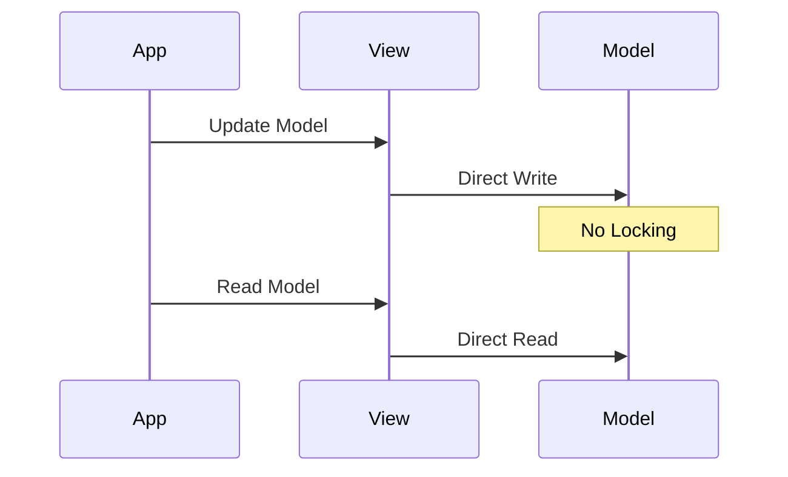
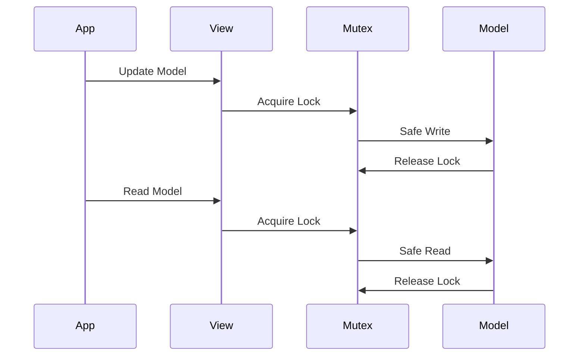
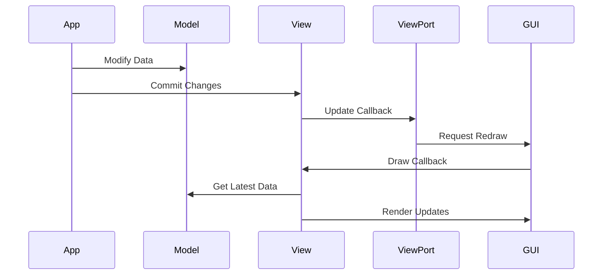

# Flipper Zero View Model Architecture

## Overview

The View Model system in Flipper Zero's GUI framework provides a robust mechanism for managing UI state and updates. It implements a pattern similar to MVVM (Model-View-ViewModel), with special considerations for embedded systems, including thread safety and memory efficiency.

## Model Types and Memory Management

The View system supports three distinct model types:

```c
typedef enum {
    ViewModelTypeNone,      // No model allocated
    ViewModelTypeLockFree,  // Lock-free model for atomic updates
    ViewModelTypeLocking,   // Thread-safe model with mutex protection
} ViewModelType;
```

### Model Allocation

Models are allocated with specific memory layouts depending on their type:

```c
void view_allocate_model(View* view, ViewModelType type, size_t size) {
    // Lock-free model: direct allocation
    if(type == ViewModelTypeLockFree) {
        view->model = malloc(size);
    } 
    // Locking model: includes mutex
    else if(type == ViewModelTypeLocking) {
        ViewModelLocking* model = malloc(sizeof(ViewModelLocking) + size);
        model->mutex = furi_mutex_alloc(FuriMutexTypeRecursive);
        view->model = model;
    }
}
```

## Thread Safety and Model Access

### Lock-Free Models

- Used for simple data structures with atomic updates
- No synchronization overhead
- Suitable for basic UI state



### Locking Models

- Protected by a recursive mutex
- Safe for complex data structures
- Prevents data races in multi-threaded scenarios



## Model Update Flow

### 1. Accessing the Model

```c
void* view_get_model(View* view) {
    if(view->model_type == ViewModelTypeLocking) {
        ViewModelLocking* model = (ViewModelLocking*)(view->model);
        furi_mutex_acquire(model->mutex, FuriWaitForever);
        return model->data;
    }
    return view->model;
}
```

### 2. Committing Changes

```c
void view_commit_model(View* view, bool update) {
    view_unlock_model(view);
    if(update && view->update_callback) {
        view->update_callback(view, view->update_callback_context);
    }
}
```

## Update Propagation System

The View system uses a callback-based approach for propagating updates:



### Key Components:

1. **Update Callback Registration**:
```c
void view_set_update_callback(View* view, ViewUpdateCallback callback);
void view_set_update_callback_context(View* view, void* context);
```

2. **Drawing System Integration**:
```c
void view_draw(View* view, Canvas* canvas) {
    if(view->draw_callback) {
        void* data = view_get_model(view);
        view->draw_callback(canvas, data);
        view_unlock_model(view);
    }
}
```

## Best Practices for Model Updates

### 1. Model Type Selection

- Use `ViewModelTypeLockFree` for:
  - Simple numeric values
  - Boolean flags
  - Atomic state changes

- Use `ViewModelTypeLocking` for:
  - Complex data structures
  - Shared state
  - Multi-threaded access

### 2. Update Optimization

```c
// Efficient update pattern
with_view_model(
    view,
    MyModel* model,
    {
        // Batch multiple updates
        model->field1 = value1;
        model->field2 = value2;
        return true; // Request update
    });
```

### 3. Memory Management

```c
// Proper cleanup
void cleanup_view() {
    view_free_model(view); // Frees mutex if locking
    view_free(view);
}
```

## C++ Integration Example

The View system can be easily integrated with C++ code using wrapper classes:

```cpp
template<typename T>
class ViewModel {
    View* view;
public:
    template<typename Func>
    void update(Func&& func) {
        with_view_model_cpp(
            view, T*, model,
            { func(model); },
            true);
    }
};
```

## Performance Considerations

1. **Update Batching**
   - Group multiple model changes
   - Commit once with a single update

2. **Lock Duration**
   - Minimize time spent with locked models
   - Prepare data before locking

3. **Draw Optimization**
   - Cache computed values
   - Use dirty flags for partial updates

## Common Patterns

### 1. Atomic Updates
```c
void atomic_update(View* view) {
    with_view_model(
        view,
        Model* model,
        {
            model->value++;
            return true;
        });
}
```

### 2. Batched Updates
```c
void batch_update(View* view, const NewData* data) {
    with_view_model(
        view,
        Model* model,
        {
            model->field1 = data->value1;
            model->field2 = data->value2;
            model->field3 = data->value3;
            return true;
        });
}
```

### 3. Conditional Updates
```c
void conditional_update(View* view, int new_value) {
    with_view_model(
        view,
        Model* model,
        {
            bool changed = model->value != new_value;
            if(changed) {
                model->value = new_value;
            }
            return changed;
        });
}
```

This architecture provides a robust foundation for building responsive UIs while maintaining data consistency and thread safety. The combination of lock-free and locking models allows developers to choose the appropriate trade-off between performance and safety for their specific use case.
