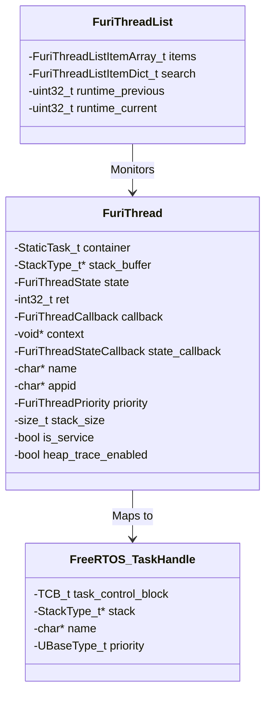
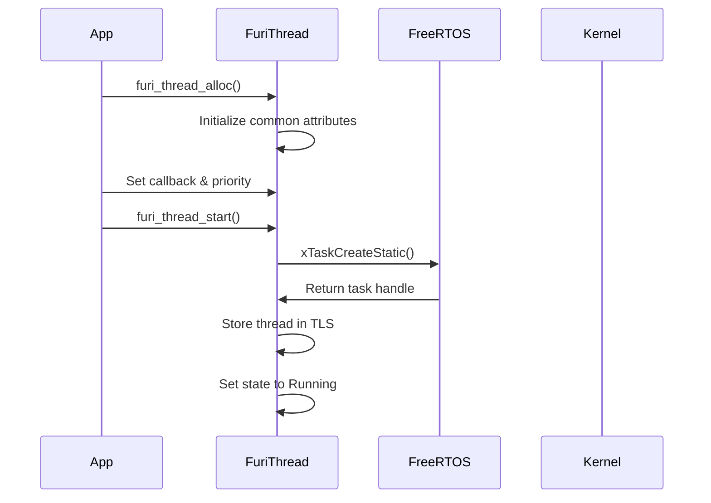
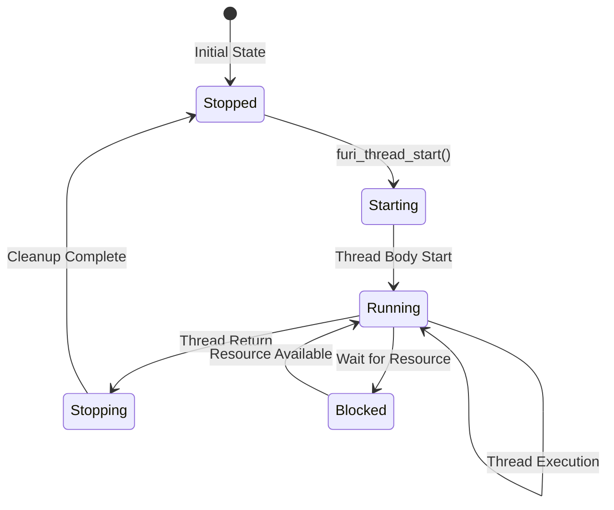

> Explain how threading is implemented in terms of freertos primitives, and what the differences are. Use mermaid diagrams for class, sequence, control flow diagrams.
>
> @core

I'll explain how FURI's threading system is implemented on top of FreeRTOS, breaking it down into key components and relationships.

### Class Structure



### Key Differences from FreeRTOS

1. **State Management**

- FURI adds explicit state tracking (Stopped, Starting, Running)
- Provides state change callbacks
- Reference in code:

```85:91:furi/core/thread.c
static void furi_thread_set_state(FuriThread* thread, FuriThreadState state) {
    furi_assert(thread);
    thread->state = state;
    if(thread->state_callback) {
        thread->state_callback(thread, state, thread->state_context);
    }
}
```

2. **Thread Types**

- Regular Threads: Dynamic creation/destruction
- Service Threads: System-level, fixed stack
- Reference:

```30:45:ttmp/2024-11-10/docs/documentation_threading.md
### Thread Types

The system supports two types of threads:

1. **Regular Threads**
   - Can be created/destroyed dynamically
   - Support full lifecycle management
   - Allow stack size changes
   - Can return from their main function

2. **Service Threads**
   - Memory-efficient system threads
   - Fixed stack size
   - Cannot return from main function
   - Used for system services and drivers

```

### Thread Creation Sequence



### Thread State Control Flow



### Key Implementation Details

1. **Thread Local Storage (TLS)**

- Each FuriThread stores itself in FreeRTOS TLS slot 0
- Used for current thread lookup and context
- Reference:

```96:102:furi/core/thread.c

    // store thread instance to thread local storage
    furi_check(pvTaskGetThreadLocalStoragePointer(NULL, 0) == NULL);
    vTaskSetThreadLocalStoragePointer(NULL, 0, thread);

    furi_check(thread->state == FuriThreadStateStarting);
    furi_thread_set_state(thread, FuriThreadStateRunning);
```

2. **Priority Management**

- Maps FURI priorities to FreeRTOS priorities
- Maintains consistent idle priority
- Reference:

```33:43:furi/core/thread.h
typedef enum {
    FuriThreadPriorityIdle = 0, /**< Idle priority */
    FuriThreadPriorityInit = 4, /**< Init System Thread Priority */
    FuriThreadPriorityLowest = 14, /**< Lowest */
    FuriThreadPriorityLow = 15, /**< Low */
    FuriThreadPriorityNormal = 16, /**< Normal, system default */
    FuriThreadPriorityHigh = 17, /**< High */
    FuriThreadPriorityHighest = 18, /**< Highest */
    FuriThreadPriorityIsr =
        (FURI_CONFIG_THREAD_MAX_PRIORITIES - 1), /**< Deferred ISR (highest possible) */
} FuriThreadPriority;
```

3. **Memory Management**

- Optional heap tracking per thread
- Stack usage monitoring
- Reference:

```135:147:furi/core/memmgr_heap.c
void memmgr_heap_enable_thread_trace(FuriThreadId thread_id) {
    vTaskSuspendAll();
    {
        memmgr_heap_thread_trace_depth++;
        furi_check(MemmgrHeapThreadDict_get(memmgr_heap_thread_dict, (uint32_t)thread_id) == NULL);
        MemmgrHeapAllocDict_t alloc_dict;
        MemmgrHeapAllocDict_init(alloc_dict);
        MemmgrHeapThreadDict_set_at(memmgr_heap_thread_dict, (uint32_t)thread_id, alloc_dict);
        MemmgrHeapAllocDict_clear(alloc_dict);
        memmgr_heap_thread_trace_depth--;
    }
    (void)xTaskResumeAll();
}
```

4. **Critical Sections**

- Wraps FreeRTOS critical sections
- Handles both ISR and thread contexts
- Reference:

```6:32:furi/core/critical.c
__FuriCriticalInfo __furi_critical_enter(void) {
    __FuriCriticalInfo info;

    info.isrm = 0;
    info.from_isr = FURI_IS_ISR();
    info.kernel_running = (xTaskGetSchedulerState() == taskSCHEDULER_RUNNING);

    if(info.from_isr) {
        info.isrm = taskENTER_CRITICAL_FROM_ISR();
    } else if(info.kernel_running) {
        taskENTER_CRITICAL();
    } else {
        __disable_irq();
    }

    return info;
}

void __furi_critical_exit(__FuriCriticalInfo info) {
    if(info.from_isr) {
        taskEXIT_CRITICAL_FROM_ISR(info.isrm);
    } else if(info.kernel_running) {
        taskEXIT_CRITICAL();
    } else {
        __enable_irq();
    }
}
```

The FURI threading system essentially provides a higher-level abstraction over FreeRTOS tasks with:

- Cleaner lifecycle management
- Built-in monitoring capabilities
- Standardized thread local storage
- Integrated heap tracking
- Service thread optimization

This abstraction makes it easier to work with threads while maintaining direct access to FreeRTOS primitives when needed.

---

> writ a clear written out section on what underlying resources the furithread uses and how it augments it.

I'll write a detailed explanation of how FuriThread uses and augments FreeRTOS resources.

# FuriThread Resource Management and FreeRTOS Integration

## Core Resources

### 1. Task Control Block Mapping

FuriThread wraps FreeRTOS's TaskHandle_t and adds additional management capabilities:

```33:63:furi/core/thread.c
struct FuriThread {
    StaticTask_t container;
    StackType_t* stack_buffer;

    volatile FuriThreadState state;
    int32_t ret;

    FuriThreadCallback callback;
    void* context;

    FuriThreadStateCallback state_callback;
    void* state_context;

    FuriThreadSignalCallback signal_callback;
    void* signal_context;

    char* name;
    char* appid;

    FuriThreadPriority priority;

    size_t stack_size;
    size_t heap_size;

    FuriThreadStdout output;

    // Keep all non-alignable byte types in one place,
    // this ensures that the size of this structure is minimal
    bool is_service;
    bool heap_trace_enabled;
};
```

Key components:

- `StaticTask_t container`: Direct mapping to FreeRTOS task container
- `StackType_t* stack_buffer`: Managed stack memory
- Custom state tracking and callbacks
- Thread-specific stdout handling
- Heap tracking capabilities

### 2. Thread Local Storage (TLS)

FuriThread uses FreeRTOS's TLS slot 0 to store a reference to itself, enabling:

- Quick current thread lookups
- Application ID tracking
- Thread context management

Reference implementation:

```96:102:furi/core/thread.c

    // store thread instance to thread local storage
    furi_check(pvTaskGetThreadLocalStoragePointer(NULL, 0) == NULL);
    vTaskSetThreadLocalStoragePointer(NULL, 0, thread);

    furi_check(thread->state == FuriThreadStateStarting);
    furi_thread_set_state(thread, FuriThreadStateRunning);
```

## Resource Augmentation

### 1. State Management

FuriThread adds an explicit state machine on top of FreeRTOS's basic running/blocked states:

- **States**:
  - FuriThreadStateStopped
  - FuriThreadStateStarting
  - FuriThreadStateRunning
  - FuriThreadStateStopping

This enables:

- Clean lifecycle management
- State change notifications
- Safe cleanup procedures

### 2. Priority System

Maps FURI priorities to FreeRTOS priorities with additional semantic meaning:

```33:43:furi/core/thread.h
typedef enum {
    FuriThreadPriorityIdle = 0, /**< Idle priority */
    FuriThreadPriorityInit = 4, /**< Init System Thread Priority */
    FuriThreadPriorityLowest = 14, /**< Lowest */
    FuriThreadPriorityLow = 15, /**< Low */
    FuriThreadPriorityNormal = 16, /**< Normal, system default */
    FuriThreadPriorityHigh = 17, /**< High */
    FuriThreadPriorityHighest = 18, /**< Highest */
    FuriThreadPriorityIsr =
        (FURI_CONFIG_THREAD_MAX_PRIORITIES - 1), /**< Deferred ISR (highest possible) */
} FuriThreadPriority;
```

### 3. Memory Management Extensions

1. **Stack Management**:

- Pre-allocated static buffers
- Stack usage monitoring
- Watermark tracking

2. **Heap Tracking**:

- Optional per-thread heap usage monitoring
- Memory leak detection
- Resource usage statistics

Implementation reference:

```166:178:furi/core/memmgr_heap.c
        if(alloc_dict) {
            leftovers = 0;
            MemmgrHeapAllocDict_it_t alloc_dict_it;
            for(MemmgrHeapAllocDict_it(alloc_dict_it, *alloc_dict);
                !MemmgrHeapAllocDict_end_p(alloc_dict_it);
                MemmgrHeapAllocDict_next(alloc_dict_it)) {
                MemmgrHeapAllocDict_itref_t* data = MemmgrHeapAllocDict_ref(alloc_dict_it);
                if(data->key != 0) {
                    uint8_t* puc = (uint8_t*)data->key;
                    puc -= xHeapStructSize;
                    BlockLink_t* pxLink = (void*)puc;
```

### 4. Thread Monitoring

FuriThread adds comprehensive monitoring through FuriThreadList:

1. **Statistics Tracking**:

- CPU usage per thread
- Stack watermarks
- Heap allocation tracking
- Runtime counters

2. **Thread Registry**:

- Thread enumeration
- State monitoring
- Resource usage tracking

Reference implementation:

```86:117:furi/core/thread_list.c
void furi_thread_list_process(FuriThreadList* instance, uint32_t runtime, uint32_t tick) {
    furi_assert(instance);

    instance->runtime_previous = instance->runtime_current;
    instance->runtime_current = runtime;

    instance->isr_previous = instance->isr_current;
    instance->isr_current = furi_hal_interrupt_get_time_in_isr_total();

    const uint32_t runtime_counter = instance->runtime_current - instance->runtime_previous;

    FuriThreadListItemArray_it_t it;
    FuriThreadListItemArray_it(it, instance->items);
    while(!FuriThreadListItemArray_end_p(it)) {
        FuriThreadListItem* item = *FuriThreadListItemArray_cref(it);
        if(item->tick != tick) {
            FuriThreadListItemArray_remove(instance->items, it);
            (void)FuriThreadListItemDict_erase(instance->search, (uint32_t)item->thread);
            free(item);
        } else {
            uint32_t item_counter = item->counter_current - item->counter_previous;
            if(item_counter && item->counter_previous && item->counter_current) {
                item->cpu = (float)item_counter / (float)runtime_counter * 100.0f;
                if(item->cpu > 200.0f) item->cpu = 0.0f;
            } else {
                item->cpu = 0.0f;
            }

            FuriThreadListItemArray_next(it);
        }
    }
}
```

## Critical Section Handling

FuriThread provides a more robust critical section implementation:

1. **Context-Aware Protection**:

- ISR vs Thread context detection
- Scheduler state awareness
- Nested critical section support

Implementation:

```6:32:furi/core/critical.c
__FuriCriticalInfo __furi_critical_enter(void) {
    __FuriCriticalInfo info;

    info.isrm = 0;
    info.from_isr = FURI_IS_ISR();
    info.kernel_running = (xTaskGetSchedulerState() == taskSCHEDULER_RUNNING);

    if(info.from_isr) {
        info.isrm = taskENTER_CRITICAL_FROM_ISR();
    } else if(info.kernel_running) {
        taskENTER_CRITICAL();
    } else {
        __disable_irq();
    }

    return info;
}

void __furi_critical_exit(__FuriCriticalInfo info) {
    if(info.from_isr) {
        taskEXIT_CRITICAL_FROM_ISR(info.isrm);
    } else if(info.kernel_running) {
        taskEXIT_CRITICAL();
    } else {
        __enable_irq();
    }
}
```

## Synchronization Primitives

FuriThread extends FreeRTOS primitives with additional features:

1. **Mutexes**:

- Normal and recursive types
- Event loop integration
- Deadlock detection support

2. **Semaphores**:

- Binary and counting types
- ISR-safe operations
- Timeout support

Reference implementations:

```21:39:furi/core/mutex.c
FuriMutex* furi_mutex_alloc(FuriMutexType type) {
    furi_check(!FURI_IS_IRQ_MODE());

    FuriMutex* instance = malloc(sizeof(FuriMutex));

    SemaphoreHandle_t hMutex;

    if(type == FuriMutexTypeNormal) {
        hMutex = xSemaphoreCreateMutexStatic(&instance->container);
    } else if(type == FuriMutexTypeRecursive) {
        hMutex = xSemaphoreCreateRecursiveMutexStatic(&instance->container);
    } else {
        furi_crash();
    }

    furi_check(hMutex == (SemaphoreHandle_t)instance);

    return instance;
}
```

```23:45:furi/core/semaphore.c
FuriSemaphore* furi_semaphore_alloc(uint32_t max_count, uint32_t initial_count) {
    furi_check(!FURI_IS_IRQ_MODE());
    furi_check((max_count > 0U) && (initial_count <= max_count));

    FuriSemaphore* instance = malloc(sizeof(FuriSemaphore));

    SemaphoreHandle_t hSemaphore;

    if(max_count == 1U) {
        hSemaphore = xSemaphoreCreateBinaryStatic(&instance->container);
    } else {
        hSemaphore =
            xSemaphoreCreateCountingStatic(max_count, initial_count, &instance->container);
    }

    furi_check(hSemaphore == (SemaphoreHandle_t)instance);

    if(max_count == 1U && initial_count != 0U) {
        furi_check(xSemaphoreGive(hSemaphore) == pdPASS);
    }

    return instance;
}
```

## Standard Output Management

FuriThread adds per-thread stdout handling:

- Buffered output
- Custom write callbacks
- Automatic flush on thread exit

This provides cleaner logging and output management compared to raw FreeRTOS tasks.

## Service Thread Optimization

FuriThread introduces the concept of service threads:

- Optimized for system services
- Fixed stack allocation
- Restricted lifecycle (cannot exit)
- Memory efficient

This specialization allows for more efficient system service implementation while maintaining the full feature set for regular threads.

The combination of these augmentations creates a more robust and feature-rich threading system while maintaining full compatibility with FreeRTOS's underlying mechanisms.


---
