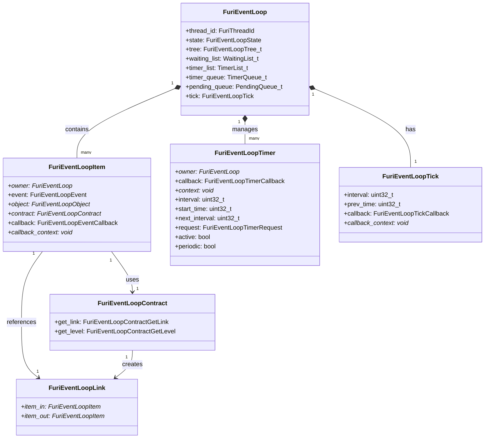
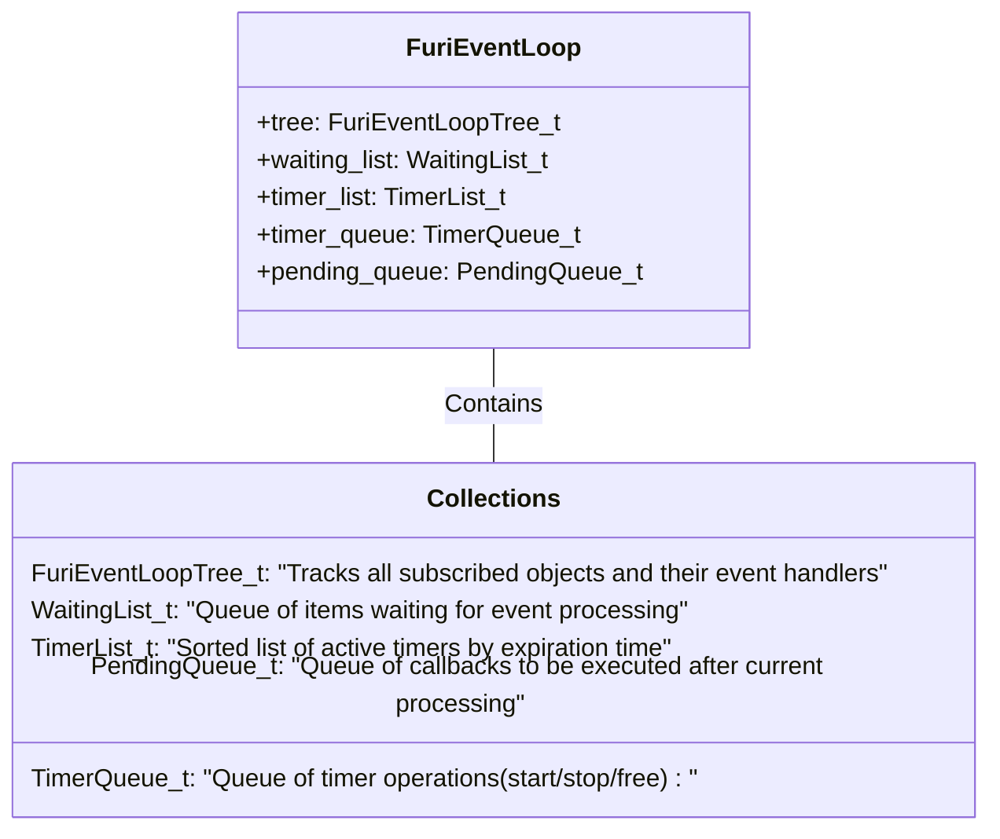
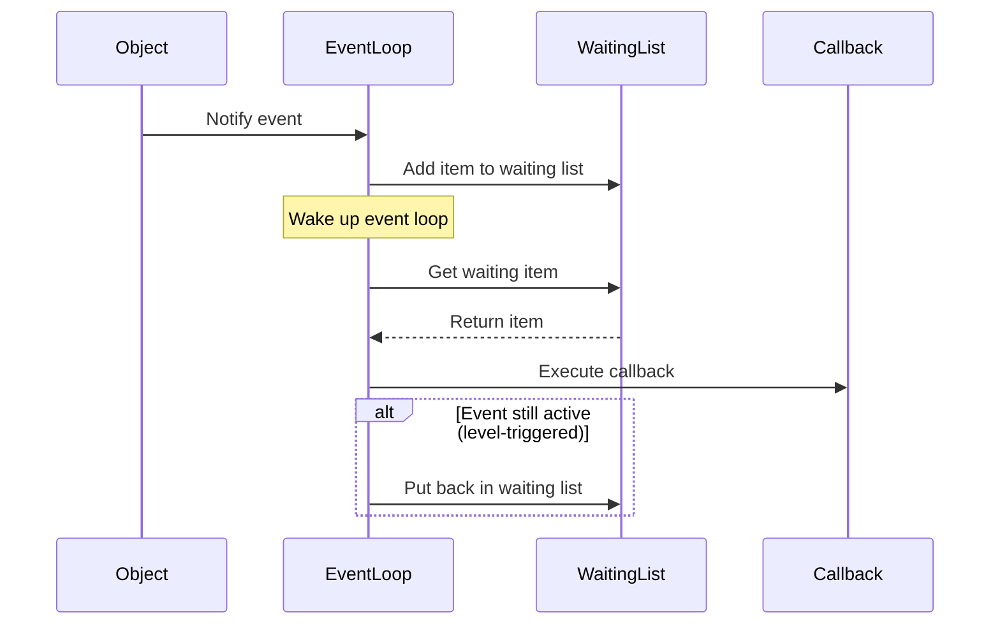
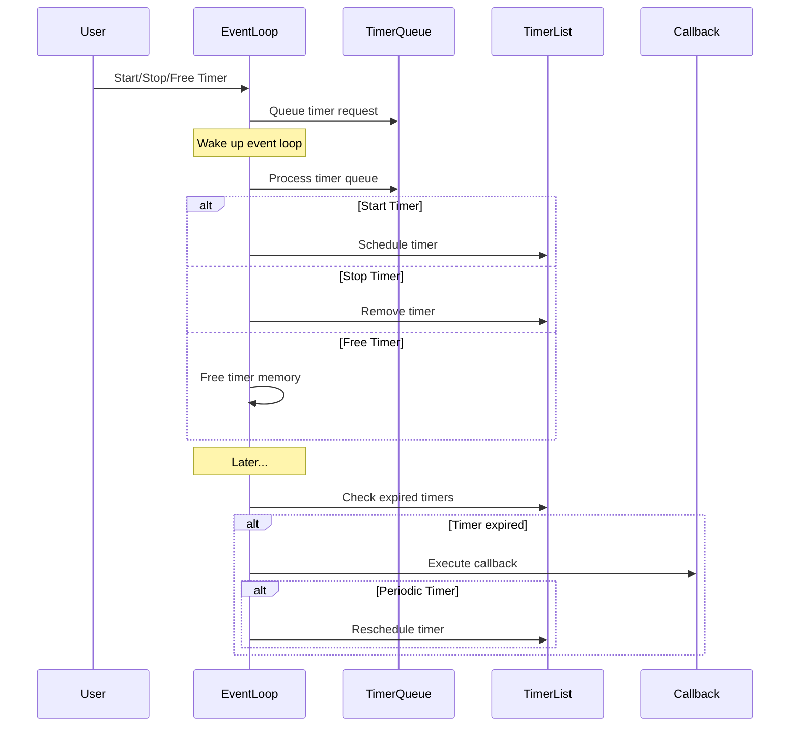
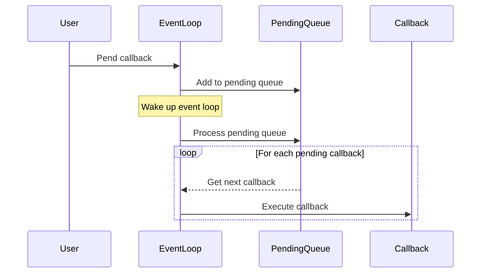
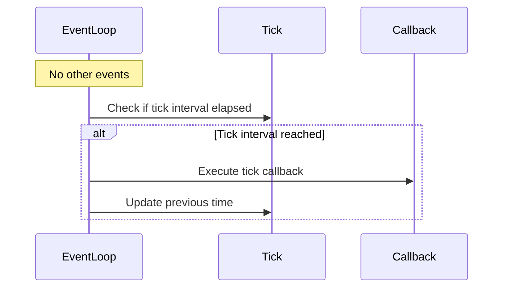

# FURI Event System Documentation

## Overview

The FURI Event System provides a robust asynchronous event processing framework built on FreeRTOS. It enables applications to handle events, timers, and inter-thread communication in a non-blocking way. The system is designed around an event loop pattern that efficiently processes multiple event sources while maintaining responsiveness.

## Core Concepts

### Event Loop

The event loop is the central component that processes events asynchronously. Each thread can have one event loop that handles:

- Timer events (periodic or one-shot)
- Message queue events
- Stream buffer events
- Mutex/semaphore events
- Custom events

The event loop runs in its own thread and processes events in order of priority. Here's how it works:

```c
// Create and start an event loop
FuriEventLoop* loop = furi_event_loop_alloc();
furi_event_loop_run(loop); // Blocks until stopped
```

### Event Types and Flags

Events can be configured with different behaviors using flags:

```c
typedef enum {
    // Direction flags
    FuriEventLoopEventIn = 0x00000001U,  // Input events (data available)
    FuriEventLoopEventOut = 0x00000002U, // Output events (space available)

    // Behavior flags
    FuriEventLoopEventFlagEdge = 0x00000004U, // Only trigger on changes
    FuriEventLoopEventFlagOnce = 0x00000008U  // One-shot event
} FuriEventLoopEvent;
```

Key concepts:

- **In/Out Events**: Determine if we're monitoring for input (data available) or output (space available) conditions
- **Edge Triggered**: Only notify on state changes rather than level
- **One-shot**: Automatically unsubscribe after first event

### Event Loop Layout

This diagram shows:

1. The main `FuriEventLoop` class which is the central component
2. `FuriEventLoopItem` representing subscribed event handlers
3. `FuriEventLoopTimer` for managing timer events
4. `FuriEventLoopTick` for handling periodic tick events
5. `FuriEventLoopLink` which connects event sources to handlers
6. `FuriEventLoopContract` defining the interface between objects and the event loop

Key relationships:

- An event loop contains multiple items and timers
- Each event loop has one tick handler
- Event loop items use contracts to interact with event sources
- Contracts create links between event sources and handlers
- Items reference links to track event flow

The diagram simplifies some of the implementation details (like the various queues and lists) to focus on the core data structure relationships.



#### Key collections

1. **FuriEventLoopTree (tree)**

   - A B+ tree data structure that maps objects to their event handlers
   - Maintains all active subscriptions in the event loop
   - Allows quick lookup of handlers when events occur
   - Used for event subscription/unsubscription management

2. **WaitingList (waiting_list)**

   - Contains items that have pending events to be processed
   - When an event occurs, the corresponding item is added here
   - The event loop processes items from this list during its run cycle
   - Ensures events are handled in order of occurrence

3. **TimerList (timer_list)**

   - Sorted list of active timers, ordered by expiration time
   - The first timer in the list is always the next one to expire
   - Used to efficiently determine how long the event loop can sleep
   - Maintains running timers in order of execution

4. **TimerQueue (timer_queue)**

   - Queue for timer operations (start/stop/free requests)
   - Allows safe modification of timers from any context
   - Operations are processed in the event loop's thread
   - Prevents race conditions in timer management

5. **PendingQueue (pending_queue)**
   - Queue for callbacks that need to be executed after current processing
   - Allows safe scheduling of work from event handlers
   - Ensures callbacks run in the event loop's thread context
   - Provides a way to defer work until a safe time

This organization allows the event loop to:

- Safely handle events from multiple sources
- Manage timers efficiently
- Process events in a deterministic order
- Avoid race conditions
- Maintain thread safety



### Event Loop Sequence

1. Basic Event Processing:

• Event processing begins when an object notifies the event loop
• Corresponding event item is added to the waiting list
• Event loop wakes up and retrieves the item
• Callback for the event is executed
• For level-triggered events:
  - Check if event condition remains active after callback
  - If active, return item to waiting list for continued monitoring
• Uses critical sections to ensure thread-safe list manipulation
• Handles both edge-triggered (one-time) and level-triggered (continuous) events
• Supports notifications from interrupt contexts



2. Timer Operations:

Timer operations involve two key flows:

• Timer Management Requests:
  - Requests to start/stop/free timers are queued in the timer queue
  - Ensures thread-safe timer modifications
  - Event loop processes queue by:
    * Scheduling timers in sorted timer list
    * Removing timers from list
    * Freeing timer memory

• Timer Expiration Handling:
  - Event loop checks for expired timers during regular operation
  - When a timer expires:
    * Execute its callback
    * Periodic timers automatically rescheduled
  - Timer list kept sorted by expiration time for efficient processing



3. Pending 

• Provides a safe mechanism to defer code execution to the event loop's thread context
• Callbacks are queued and executed in order during the event loop's processing cycle
• Key use cases:
  - Handling cleanup operations
  - Modifying event loop state from interrupts or different threads
• Ensures thread-safe marshaling of operations to the correct execution context



4. Tick Processing:

• Single tick handler per event loop
• Executes only when no other events are pending
• Low-priority, periodic maintenance mechanism
• Runs only during event loop idle time
• Ideal for:
  - Updating UI elements
  - Performing system health checks
• Non-intrusive design prioritizes time-critical events
• Callback executed when tick interval elapses
• Previous time updated for next interval calculation



### Event Loop States

The event loop can be in one of three states:

```c
typedef enum {
    FuriEventLoopStateStopped,    // Not running
    FuriEventLoopStateIdle,       // Waiting for events
    FuriEventLoopStateProcessing  // Processing events
} FuriEventLoopState;
```

## Timer System

The timer system provides both one-shot and periodic timer capabilities:

```c
// Create a periodic timer
FuriEventLoopTimer* timer = furi_event_loop_timer_alloc(
    loop,
    timer_callback,
    FuriEventLoopTimerTypePeriodic,
    context
);

// Start timer with 1000ms interval
furi_event_loop_timer_start(timer, 1000);
```

Key timer features:

- Periodic or one-shot operation
- Dynamic start/stop/restart
- Remaining time queries
- Automatic cleanup on event loop shutdown

### Timer Implementation

Timers are implemented using an ordered list to efficiently track expiration:

```c
struct FuriEventLoopTimer {
    FuriEventLoop* owner;
    FuriEventLoopTimerCallback callback;
    void* context;
    uint32_t interval;
    uint32_t start_time;
    bool active;
    bool periodic;
};
```

The event loop maintains timers in order of expiration for efficient processing.

## Event Subscription System

The subscription system allows monitoring different event sources:

```c
// Subscribe to message queue events
furi_event_loop_subscribe_message_queue(
    loop,
    queue,
    FuriEventLoopEventIn,  // Monitor for incoming messages
    queue_callback,
    context
);
```

Supported subscription types:

- Message Queues
- Stream Buffers
- Semaphores
- Mutexes

### Subscription Implementation

Each subscription is tracked using an event loop item:

```c
struct FuriEventLoopItem {
    FuriEventLoop* owner;
    FuriEventLoopEvent event;
    FuriEventLoopObject* object;
    FuriEventLoopCallback callback;
    void* callback_context;
};
```

The event loop maintains a tree of subscriptions for efficient lookup.

## Best Practices

### Thread Safety

Event loops are thread-bound:

```c
// CORRECT: Run in owning thread
FuriEventLoop* loop = furi_event_loop_alloc();
furi_event_loop_run(loop);

// WRONG: Running in different thread
some_other_thread_run_loop(loop); // Will crash!
```

### Non-blocking Callbacks

Event callbacks must not block:

```c
// WRONG: Blocking callback
bool bad_callback(FuriEventLoopObject* obj, void* ctx) {
    furi_delay_ms(1000); // Never block!
    return true;
}

// CORRECT: Quick processing
bool good_callback(FuriEventLoopObject* obj, void* ctx) {
    process_event_data(obj); // Quick processing
    return true;
}
```

### Resource Cleanup

Always cleanup resources in the correct order:

```c
// Correct cleanup order
void cleanup(FuriEventLoop* loop) {
    // 1. Stop all timers
    furi_event_loop_timer_stop(timer);

    // 2. Unsubscribe from events
    furi_event_loop_unsubscribe(loop, object);

    // 3. Free timers
    furi_event_loop_timer_free(timer);

    // 4. Free event loop
    furi_event_loop_free(loop);
}
```

## Example Usage

Here's a complete example showing common event loop patterns:

```c
typedef struct {
    FuriEventLoop* event_loop;
    FuriEventLoopTimer* timer;
    FuriMessageQueue* queue;
} App;

// Timer callback
static void timer_callback(void* context) {
    App* app = context;
    // Process timer event
}

// Queue callback
static bool queue_callback(FuriEventLoopObject* obj, void* ctx) {
    App* app = ctx;
    Message msg;
    if(furi_message_queue_get(app->queue, &msg, 0) == FuriStatusOk) {
        // Process message
        return true;
    }
    return false;
}

// Main application
int32_t app_main(void* p) {
    App* app = malloc(sizeof(App));

    // Setup event loop
    app->event_loop = furi_event_loop_alloc();

    // Create timer
    app->timer = furi_event_loop_timer_alloc(
        app->event_loop,
        timer_callback,
        FuriEventLoopTimerTypePeriodic,
        app
    );

    // Setup queue
    app->queue = furi_message_queue_alloc(10, sizeof(Message));
    furi_event_loop_subscribe_message_queue(
        app->event_loop,
        app->queue,
        FuriEventLoopEventIn,
        queue_callback,
        app
    );

    // Start processing
    furi_event_loop_timer_start(app->timer, 1000);
    furi_event_loop_run(app->event_loop);

    // Cleanup
    furi_event_loop_timer_stop(app->timer);
    furi_event_loop_timer_free(app->timer);
    furi_message_queue_free(app->queue);
    furi_event_loop_free(app->event_loop);
    free(app);

    return 0;
}
```


## Advanced Topics

### Event Loop Internals

The event loop uses several internal queues and lists:

- `waiting_list`: Events waiting to be processed
- `timer_list`: Active timers in expiration order
- `timer_queue`: Timer control requests
- `pending_queue`: Pending callbacks

This allows efficient event processing while maintaining proper ordering.

### Performance Considerations

- Keep callbacks quick and non-blocking
- Use edge-triggered events when possible to reduce processing
- Consider using stream buffers for high-throughput data
- Clean up unused subscriptions and timers

The event system provides a powerful foundation for building responsive applications while maintaining clean separation of concerns and proper resource management.
